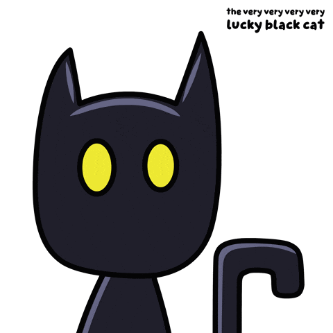

# Sana Khuram | Frontend Developer & Designer

Welcome to my portfolio! I’m **Sana Khuram**, a frontend developer with a strong artistic background. My work combines **creativity, design, and code** to build interactive, responsive, and visually engaging web experiences.  

This portfolio showcases my projects, skills, and personal design style. It is designed to be **focused, professional, and easy to navigate**, highlighting the work and experiences that best reflect my abilities.

---

## **Tech Stack**

---

## **Sections Overview**
- **Home / Hero:** Introduction, interactive hero section, and animated slides  
- **About Me:** Artistic background, focus areas, and exploration of side projects  
- **Projects:** Showcase of real-world projects with links to live demos and repositories  
- **Awards:** Achievements and recognition highlights  
- **Skills:** Frontend and design-related technical skills  
- **Contact:** Contact form and collaboration opportunities  

---

## **Key Highlights**
- **Built 5+ interactive UI components and SPAs** with React, Next.js, and TailwindCSS  
- **Designed fully responsive, accessible, and high-performance interfaces**  
- **Created custom animations and transitions** using Framer Motion  
- **Blended artistic sensibilities into frontend development**, integrating illustration and design with code  
- **Curated and implemented icons and SVGs** from IconFinder and react-icons to enhance UI aesthetics  

All layouts, color palettes, and typography are self-chosen. The goal is to provide a unique, immersive experience that reflects both my technical skills and creative vision.

---

> “Creativity is intelligence having fun.” – Albert Einstein

---

## **Projects**

| Project | Description | Links |
|---------|-------------|-------|
| **Vibe Cart** | E-commerce app with shopping cart, search, and filtering | [Live Demo](https://vibecart.vercel.app) | [GitHub](https://github.com/sanakhuram/vibecart) |
| **Sociogram** | Social media platform for students with profiles and posts | [Live Demo](https://sociogram.vercel.app) | [GitHub](https://github.com/sanakhuram/sociogram) |
| **Auction Hub** | Auction platform with dynamic listings and bidding | [Live Demo](https://auctionhub.vercel.app) | [GitHub](https://github.com/sanakhuram/auctionhub) |

---

## **About Me / Fun Section**

  
  

    🐱 I’m a playful frontend dev, always ready to mix creativity and code! 
    Feel free to explore my projects and reach out via the contact section—I’m always excited to collaborate and bring creative ideas to life!
  

---

## **Contact Me**
- Email: [sana.khuram.baig@gmail.com](mailto:sana.khuram.baig@gmail.com)  
- LinkedIn: [linkedin.com/in/sana-khuram-157ba02b7](https://www.linkedin.com/in/sana-khuram-157ba02b7/)  
- GitHub: [github.com/sanakhuram](https://github.com/sanakhuram)

---

**© Sana Khuram 2025**  
